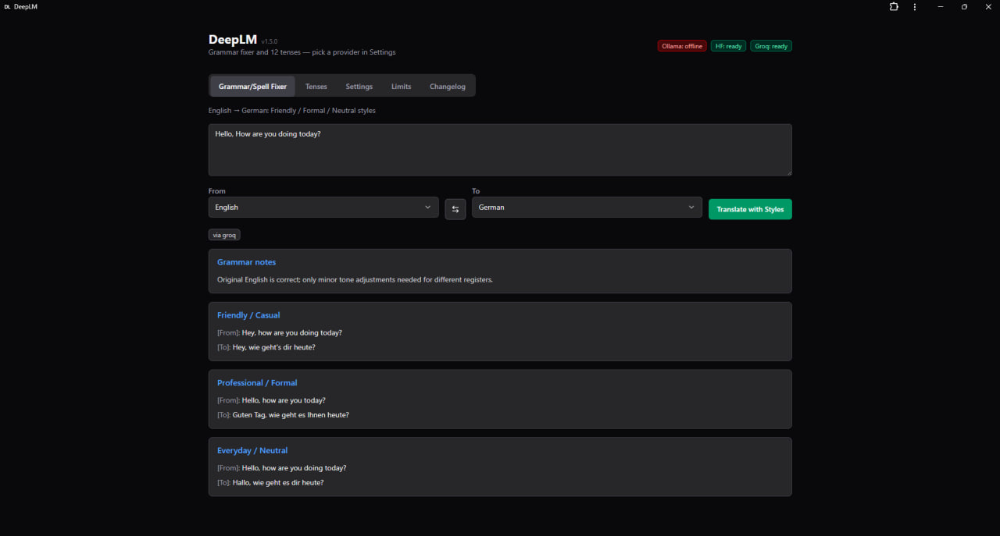
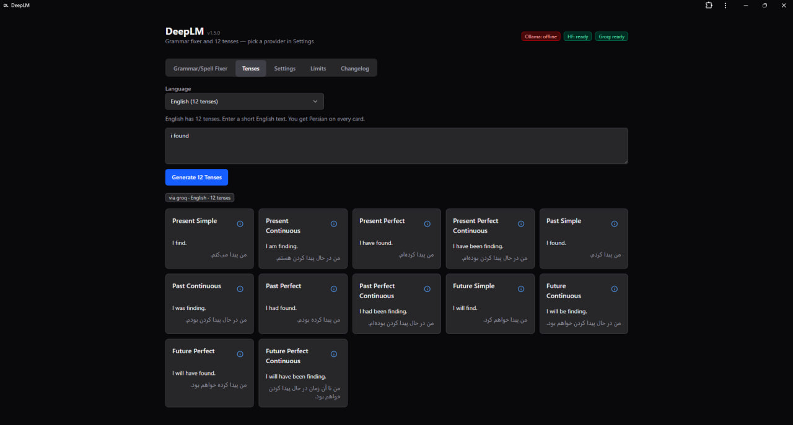
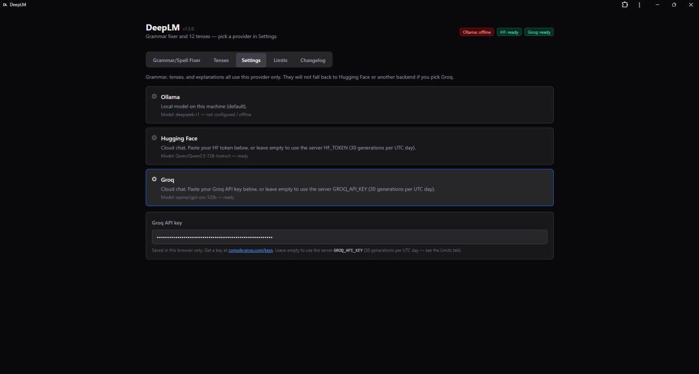
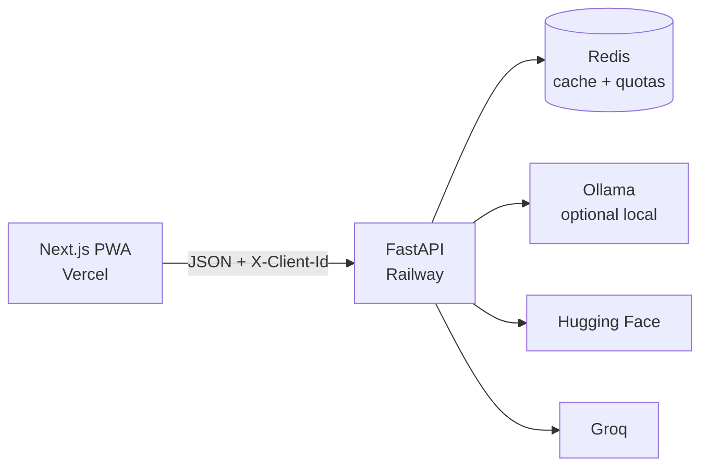

# DeepLM

Grammar correction, translation styles, and tense practice in the browser — backed by **Ollama**, **Hugging Face**, or **Groq**.

[](https://deep-lm.vercel.app)
[](https://deeplm.up.railway.app/health)
[](CHANGELOG.md)
[](https://github.com/master2it/DeepLM)
[](https://github.com/master2it/DeepLM)

**Demo:** [deep-lm.vercel.app](https://deep-lm.vercel.app) · **API:** [deeplm.up.railway.app](https://deeplm.up.railway.app/health)

## Screenshots

<p align="center">
  
</p>

<p align="center"><em>Grammar / Spell Fixer — three style variants (via Groq)</em></p>

<p align="center">
  
</p>

<p align="center"><em>Tenses — English 12-tense chart with Persian on every card</em></p>

<p align="center">
  
</p>

<p align="center"><em>Settings — exclusive provider (Ollama, Hugging Face, or Groq)</em></p>

---

## Why DeepLM

DeepLM is a small, self-hostable language-learning tool: fix a sentence in several styles, generate tense charts with Persian glosses, and explain a tense without sending your text to a closed proprietary UI. You can run a local model with Ollama, or call Hugging Face / Groq. Visitors can paste their own API keys in Settings; shared server keys are rate-limited.

## Features

| Area | What you get |
| --- | --- |
| **Grammar / spell fixer** | Default pair English → Persian. Three styles (friendly, formal, everyday). German ↔ Persian uses *du/Sie* and *تو/شما*. |
| **Tenses** | English: 12 tenses. German: 6 (Präsens, Präteritum, Perfekt, Plusquamperfekt, Futur I, Futur II). Persian gloss on every card. |
| **Tense explanation** | Per-tense teaching notes and examples (cached in Redis like grammar/tenses). |
| **Providers** | Settings pick is **exclusive**: Ollama, Hugging Face, or Groq — no silent vendor fallback. |
| **Limits** | Groq: **30/UTC day** for grammar, tenses, and explain, with your key **or** the server key. Hugging Face: 30/day on the shared server token only; your own HF key is uncapped. Counted by browser id **and** IP. Cache hits do not count. |
| **PWA** | Installable on HTTPS (manifest, service worker, header Install button). |
| **Changelog** | Versions tab is generated from [`CHANGELOG.md`](CHANGELOG.md). |

## Architecture



| Layer | Stack |
| --- | --- |
| Frontend | Next.js (App Router), React, TypeScript, Tailwind, Serwist |
| Backend | FastAPI, Pydantic Settings, httpx, Hugging Face Hub client |
| Data | Redis (response cache, 12h TTL; daily quotas) |

Monorepo layout:

```text
.
├── backend/          FastAPI app (`app.main:app`)
├── frontend/         Next.js UI
├── docker-compose.yml
├── railway.toml      API deploy (Railpack)
└── VERSION           Semver source of truth
```

## Requirements

- Python 3.12+ (backend)
- Node.js 20+ (frontend)
- [Redis](https://redis.io/) (cache and default-key quotas)
- [Ollama](https://ollama.com) on the host if you use the local provider
- Docker Desktop optional (Redis + API)

```bash
ollama pull deepseek-r1
ollama serve
```

Ollama should listen on port `11434`.

## Quick start

### 1. Environment

```bash
cp .env.example .env   # Windows: copy .env.example .env
```

Never commit `.env`. Hugging Face and Groq tokens are optional; they are only required when that provider is selected (or as a server default for visitors).

### 2. Redis + API with Docker

```bash
docker compose up --build
```

| Service | URL |
| --- | --- |
| UI (run separately) | [http://localhost:3000](http://localhost:3000) |
| API | [http://localhost:8000](http://localhost:8000) |
| Health | [http://localhost:8000/health](http://localhost:8000/health) |

Compose starts **Redis** and the **backend**. Ollama stays on the host; the API container uses `http://host.docker.internal:11434`.

### 3. Frontend

```bash
cd frontend
npm install          # or pnpm install
# Unix
export NEXT_PUBLIC_API_URL=http://localhost:8000
npm run dev
# Windows PowerShell
$env:NEXT_PUBLIC_API_URL="http://localhost:8000"
npm run dev
```

### Backend without Docker

Start Redis first (`docker compose up redis` or a local Redis). Then:

```bash
cd backend
python -m venv .venv
# Unix: source .venv/bin/activate
# Windows: .venv\Scripts\activate
pip install -r requirements.txt
# Unix
export OLLAMA_BASE_URL=http://127.0.0.1:11434
export REDIS_URL=redis://127.0.0.1:6379/0
uvicorn app.main:app --reload --port 8000
# Windows PowerShell
$env:OLLAMA_BASE_URL="http://127.0.0.1:11434"
$env:REDIS_URL="redis://127.0.0.1:6379/0"
uvicorn app.main:app --reload --port 8000
```

`GET /health` should include `"redis": true` before you rely on cache or shared HF/Groq keys.

## Configuration

Copy [`.env.example`](.env.example). Important variables:

| Variable | Purpose |
| --- | --- |
| `HF_TOKEN` / `GROQ_API_KEY` | Server default keys. Groq is always 30/day (pasted or server). HF is 30/day only for the server token. |
| `HF_DEFAULT_DAILY_LIMIT` / `GROQ_DEFAULT_DAILY_LIMIT` | Default `30`. |
| `OLLAMA_BASE_URL` / `OLLAMA_MODEL` | Local model (`deepseek-r1` by default). |
| `HF_CHAT_MODEL` / `GROQ_MODEL` | Defaults: `Qwen/Qwen2.5-72B-Instruct`, `openai/gpt-oss-120b`. |
| `REDIS_URL` / `REDIS_PRIVATE_URL` | Cache + quotas. Private URL is preferred on Railway. |
| `REDIS_TTL_SECONDS` | Cache TTL (default `43200` = 12 hours). |
| `CORS_ORIGINS` | Comma-separated browser origins. |
| `NEXT_PUBLIC_API_URL` | Frontend → API base URL (baked in at **build** time). |

API keys and Groq/HF tokens are **never** written to Redis. Cache keys hash text, languages, tense, and provider only.

## HTTP API

Base URL in production: `https://deeplm.up.railway.app`.

| Method | Path | Notes |
| --- | --- | --- |
| `GET` | `/health` | Version, provider status, Redis reachability. |
| `GET` | `/api/providers` | Same payload as health. |
| `GET` | `/api/languages` | Grammar languages, tense counts, German tense labels. |
| `GET` | `/api/limits` | Daily usage. Send `X-Client-Id`. `Cache-Control: no-store`. |
| `GET` | `/api/changelog` | Parsed changelog for the Versions tab. |
| `POST` | `/api/grammar` | Styled grammar / translation. |
| `POST` | `/api/tenses` | Tense chart. |
| `POST` | `/api/tenses/explain` | Tense explanation. |

Generation endpoints accept `provider`, optional `hf_api_key` / `groq_api_key`, and use Redis cache when Redis is up. Repeat requests with the same inputs return `"cached": true` and do not increment quotas.

### LLM routing

1. If Settings (or the request) names a provider, **only that provider** runs.
2. If no provider is sent, try Ollama (`think: false`), then Hugging Face, then Groq.
3. Leftover `<think>` blocks are stripped from replies.
4. An explicit Groq / HF / Ollama choice fails closed if that provider is missing or errors.
5. Groq generations (your key or the server key) and default-key Hugging Face generations require Redis (503 if Redis is down) so the 30/day cap can be enforced.

## Deployment

The repo root is a **monorepo**. Railpack builds the **FastAPI** service. Deploy the Next.js app separately (for example Vercel) with `NEXT_PUBLIC_API_URL` pointing at the API.

Do not set the Railway service root to `frontend/`. `railpack.json` starts Uvicorn from `backend/`.

### API (Railway)

Set at least:

```env
CORS_ORIGINS=https://deep-lm.vercel.app,http://localhost:3000
HF_TOKEN=
GROQ_API_KEY=
OLLAMA_BASE_URL=http://127.0.0.1:11434
REDIS_TTL_SECONDS=43200
```

Add a **Redis** plugin on the same project and environment. On the **API service** (not the Redis plugin), set:

```text
REDIS_PRIVATE_URL=${{ Redis.REDIS_PRIVATE_URL }}
```

If the canvas service is not named `Redis`, use that name instead. Redeploy. Confirm `GET /health` → `"redis": true`.

`REDIS_PRIVATE_URL` is for Railway’s private network. It will not work from your laptop; local runs use `REDIS_URL=redis://127.0.0.1:6379/0` (see `railway.toml` `[environments.local.variables]`).

### Frontend (Vercel)

- Root directory: `frontend`
- Install: pnpm or npm
- Env: `NEXT_PUBLIC_API_URL=https://deeplm.up.railway.app`
- Rebuild after changing `NEXT_PUBLIC_API_URL`

Production PWA build uses webpack so Serwist can inject the worker: `npm run build` then `npm run start`.

## Progressive Web App

| Piece | Location |
| --- | --- |
| Manifest | `/manifest.webmanifest` |
| Icons | `frontend/public/icons/icon-192.png`, `icon-512.png` |
| Service worker | `/sw.js` (build output; **disabled** in `next dev`) |
| Offline | `/offline` (shell only; API stays network-only) |

Chromium: header **Install app**. iOS: Share → Add to Home Screen.

## Tests

```bash
cd backend
python -m unittest discover -s tests -v
```

Targeted:

```bash
python -m unittest tests.test_config tests.test_quota tests.test_cache tests.test_translation_quality tests.test_tenses -v
```

## Versioning

Canonical semver is [`VERSION`](VERSION). It is shown in the UI and on `GET /health`.

Each push to `main` runs [`.github/workflows/bump-version.yml`](.github/workflows/bump-version.yml), which increments the **patch** and tags `vX.Y.Z`. Commits whose message contains `chore: bump version` are skipped so the bot does not loop. For a **minor** or **major** release, bump `VERSION` (and the mirrored files) in the same PR before merge.

Log every change in [`CHANGELOG.md`](CHANGELOG.md) as **major**, **minor**, **patch**, or **release**.

## Contributing

Issues and pull requests are welcome at [github.com/master2it/DeepLM](https://github.com/master2it/DeepLM).

1. Fork and branch from `main`.
2. Keep secrets out of git (`.env`, tokens, Redis passwords).
3. Add or update a `CHANGELOG.md` entry in the same PR.
4. Prefer small, reviewable diffs. Match existing code style.
5. If you change public API or provider behavior, update this README.

## Security

- Do not commit API keys, Redis URLs with passwords, or `.env`.
- Browser-pasted Groq/HF keys stay in `localStorage` and are sent only to your configured API.
- Default-key daily limits exist to protect shared tokens, not as a security boundary.
- Report vulnerabilities privately via GitHub [Security advisories](https://github.com/master2it/DeepLM/security/advisories/new) if available, otherwise open a private contact with the maintainer.

## License

MIT. Copyright [Master2iT](https://github.com/master2it).
