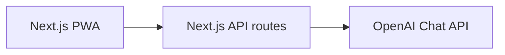

# DeepLM

DeepLM is a self-hosted Next.js language-learning app for grammar correction, translation styles, and English/German tense practice with Persian glosses. All generation is handled server-side through OpenAI.

## Architecture


```mermaid
flowchart LR
  browser[Next.js PWA] --> routes[Next.js API routes]
  routes --> openai[OpenAI Chat API]
```

The repository is a single Next.js App Router application. The browser calls same-origin `/api/*` route handlers; `OPENAI_API_KEY` is never exposed to the client.

## Requirements

- Node.js 20+
- An OpenAI API key

## Quick start

```bash
copy .env.example .env.local
npm install
npm run dev
```

Set `OPENAI_API_KEY` in `.env.local`, then visit [http://localhost:3000](http://localhost:3000).

## Configuration

| Variable | Purpose |
| --- | --- |
| `OPENAI_API_KEY` | Server-side OpenAI key, required for generation. |
| `OPENAI_MODEL` | Chat model to use; defaults to `gpt-4o-mini`. |

## API

| Method | Path | Purpose |
| --- | --- | --- |
| `GET` | `/api/health` | Application and OpenAI configuration status. |
| `GET` | `/api/languages` | Language, locale, and tense metadata. |
| `GET` | `/api/changelog` | Release list for the Versions tab. |
| `POST` | `/api/grammar` | Grammar correction and styled translation. |
| `POST` | `/api/tenses` | English or German tense chart. |
| `POST` | `/api/tenses/explain` | Tense explanation and examples. |

## Deployment

Deploy the repository root to Vercel or any Node-compatible host. Configure `OPENAI_API_KEY` and optionally `OPENAI_MODEL` as server environment variables. Do not prefix either variable with `NEXT_PUBLIC_`.

## Versioning

Canonical semver is [`VERSION`](VERSION). Log changes in [`CHANGELOG.md`](CHANGELOG.md).

## License

MIT. Copyright [Master2iT](https://github.com/master2it).
